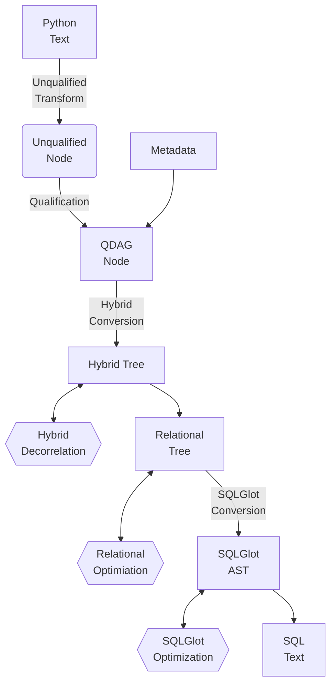
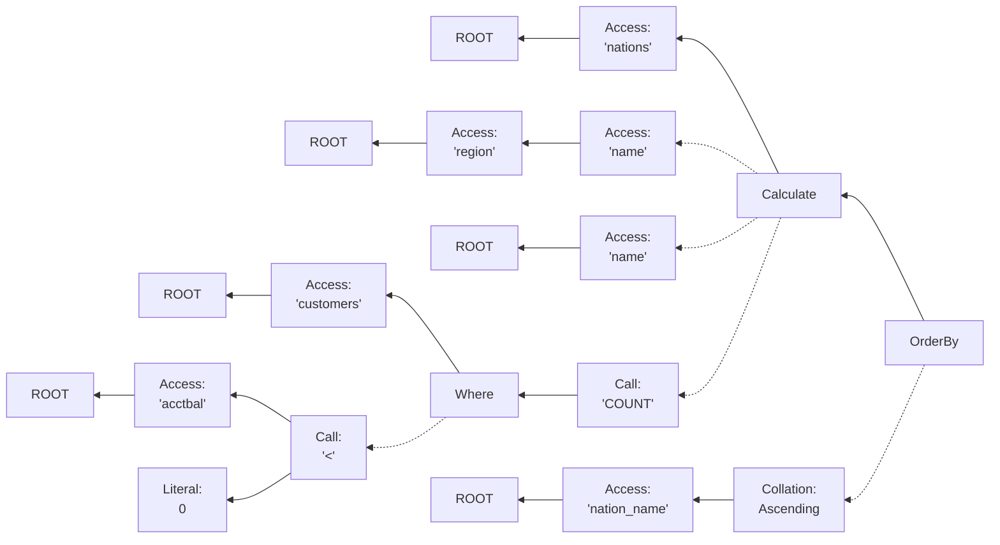
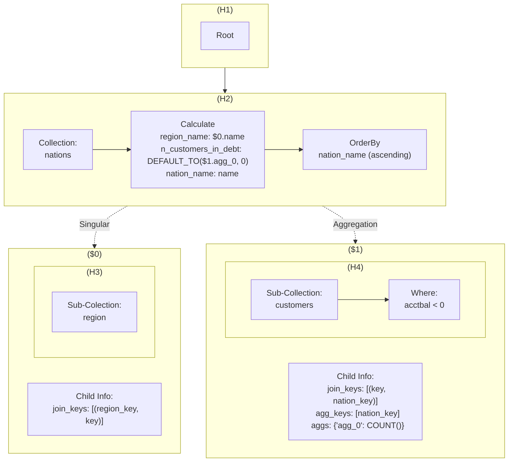
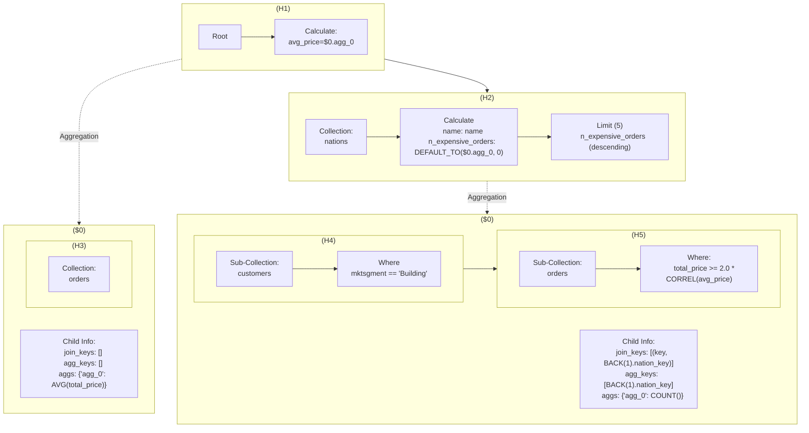

# PyDough Internal Representations Guide

This document describes the various IRs used by PyDough to convert raw PyDough code into SQL text, as well as the conversion processes between them.

<!-- TOC start (generated with https://github.com/derlin/bitdowntoc) -->

- [Overview](#overview)
- [Unqualified Nodes](#unqualified-nodes)
  - [Unqualified Transform](#unqualified-transform)
- [QDAG Nodes](#qdag-nodes)
  - [Qualification](#qualification)
- [Hybrid Tree](#hybrid-tree)
  - [Hybrid Conversion](#hybrid-conversion)
  - [Hybrid Decorrelation](#hybrid-decorrelation)
- [Relational Tree](#relational-tree)
  - [Relational Conversion](#relational-conversion)
  - [Relational Optimization](#relational-conversion)
- [SQLGlot AST](#sqlglot-ast)
  - [SQLGlot Conversion](#sqlglot-conversion)
  - [SQLGlot Optimization](#sqlglot-optimization)

<!-- TOC end -->

<!-- TOC --><a name="overview"></a>
## Overview

The overarching pipeline for converting PyDough Python text into SQL text is as follows:
1. The Python text is intercepted and re-written in a [transformation](#unqualified-transform) that replaces undefined variable names with certain objects, ensuring that when the Python code is executed the result is an [unqualified node](#unqualified-nodes). These unqualified nodes are very minimal in terms of information stored,
2. When `to_sql` or `to_df` is called on this unqualified nodes, it is first sent through a process called [qualification](#qualification) which converts unqualified nodes into qualified DAG nodes, or [QDAG nodes](#qdag) for short. These QDAG nodes utilize the metadata in order to correctly associate every aspect of the PyDough logic with the data being analyzed/transformed, and is also where a great deal of the verification of the PyDough code's validity happens.
3. Next, the QDAG nodes are run through a process called [hybrid conversion](#hybrid-conversion) which restructures the logic into the datastructure known as the [hybrid tree](#hybrid-tree) in order to better organize the types of ways different subtrees of the data are linked together.
4. The hybrid tree is further transformed by the [decorrelation procedure](#hybrid-decorrelation) to remove correlated references created by the hybrid conversion process.
5. The transformed hybrid tree is converted into a [relational tree](#relational-tree) highly reminiscent of the datastructure used to represent relational algebra in frameworks such as Apache Calcite. The conversion to this datastructure is called [relational conversion](#relational-conversion).
6. Several [optimizations](#relational-optimization) are performed on the relational tree to combine/delete/split/transpose relational nodes, resulting in plans that are better for performance and/or visual quality when converted to SQL.
7. The Relational tree is [converted](#sqlglot-conversion) into the [internal AST](#sqlglot-ast) used by the open source Python library SQLGlot. This library is used for transpiling between different SQL dialects, so it is trivial to convert the SQLglot AST into SQL text of many different dialects.
8. The SQLGlot AST is [simplified & optimized](#sqlglot-optimization) less so to improve the performance of the SQL when executed, and moreso to improve the visual quality when it is converted into text.
9. A simple method call on the final SQLGlot AST converts it into SQL text of the desired dialect, which can then be executed via a database connector API.

To recap, the overall pipeline is as follows (if viewing with VSCode preview, you must install the mermaid markdown extension):



<!-- TOC --><a name="unqualified-nodes"></a>
## Unqualified Nodes

TODO

Below is an example of the structure of unqualified nodes for the following PyDough expression:
```py
nation_info = nations.CALCULATE(
  region_name=region.name,
  nation_name=name,
  n_customers_in_debt=COUNT(customers.WHERE(acctbal < 0))
).ORDER_BY(nation_name.ASC())
```



In the example above, `nation_info` refers to the `OrderBy` node on the right side of the diagram.

<!-- TOC --><a name="unqualified-transform"></a>
### Unqualified Transform

TODO

For an example of the QDAG structure, consider the `nation_info` example earlier from the unqualified nodes:

```py
nation_info = nations.CALCULATE(
  region_name=region.name,
  nation_name=name,
  n_customers_in_debt=COUNT(customers.WHERE(acctbal < 0))
).ORDER_BY(nation_name.ASC())
```

This has the following structure as QDAG nodes:

```
──┬─ TPCH
  ├─── TableCollection[nations]
  ├─┬─ Calculate[region_name=$1.name, nation_name=name, n_customers_in_debt=COUNT($2)]
  │ ├─┬─ AccessChild
  │ │ └─── SubCollection[region]
  │ └─┬─ AccessChild
  │   ├─── SubCollection[customers]
  │   └─── Where[acctbal < 0]
  └─── OrderBy[nation_name.ASC(na_pos='first')]
```


<!-- TOC --><a name="qdag-nodes"></a>
## QDAG Nodes

TODO

<!-- TOC --><a name="qualification"></a>
### Qualification

TODO

<!-- TOC --><a name="hybrid-tree"></a>
## Hybrid Tree

TODO

<!-- TOC --><a name="hybrid-conversion"></a>
### Hybrid Conversion

TODO

For an example of the Hybrid Tree structure, consider the `nation_info` example earlier from the unqualified nodes:

```py
nation_info = nations.CALCULATE(
  region_name=region.name,
  nation_name=name,
  n_customers_in_debt=COUNT(customers.WHERE(acctbal < 0))
).ORDER_BY(nation_name.ASC())
```



In this example, the main hybrid tree has two levels H1 and `H2` (`H2` is the value pointed to when the QDAG is converted to a hybrid tree).
- `H1`/`H2` have a parent/successor relationship where H1 is the parent and `H2` is the successor.
- `H1` has no children and its pipeline has a single operation denoting the root level.
- `H2` has two children (`$0` and `$1`) and its pipeline has 3 operations:
  - An access to the nations collection (how the step-down from `H1` to `H2` begins)
  - A calculate that defines `region_name`, `nation_name`, and `n_customers_in_debt`
  - An order-by that sorts by `nation_name` in ascending order.
- `$0` is a singular access, meaning the data from `H2` and `$0` can be directly joined without needing to worry about changes in cardinality. They are joined on the condition that the `region_key` term from `H2` equals the `key` term from the bottom subtree of `$0` (which is `H3`).
  - The contents of `$0` is just a single tree level `H3` which does not have any children and has a pipeline containing only an access to the `regions` collection.
- `$1` is an aggregation access, meaning the data from `$1` must first be aggregated before it is joined with `H2`. The aggregation is done by grouping on the `nation_key` field of the bottom subtree of `$1` (which is `H4`) and computes the term `agg_0` as `COUNT()`. Then, the result is joined with `H2` on the condition that the `key` term from `H2` equals the `nation_key` field just used to aggregate.
  - The contents of `$1` is just a single tree level `H4` which does not have any children and has a pipeline containing an access to the `customers` collection followed by a filter on the condition that `acctbal < 0`.


Now consider a slightly more complex example below. This PyDough code finds the 5 nations with the largest number of orders made by customers in that nation in the building market segment where the total price of the order is at least double the average of the total prices of **all** orders.
```py
global_info = TPCH.CALCULATE(avg_price=AVG(Orders.total_price))
building_customers = customers.WHERE(mktsegment=="BUILDING")
selected_orders = building_customers.WHERE(total_price >= 2.0 * avg_price)
nation_info = Nations.CALCULATE(
    name=name,
    n_expensive_building_orders=COUNT(selected_orders),
).TOP_K(5, by=n_expensive_orders.DESC())
```

Below is the Hybrid Tree structure for this query:



<!-- TOC --><a name="hybrid-decorrelation"></a>
### Hybrid Decorrelation

TODO

<!-- TOC --><a name="relational-tree"></a>
## Relational Tree

TODO

<!-- TOC --><a name="relational-conversion"></a>
### Relational Conversion

TODO

<!-- TOC --><a name="relational-optimization"></a>
### Relational Optimization

TODO

<!-- TOC --><a name="sqlglot-ast"></a>
## SQLGlot AST

TODO

<!-- TOC --><a name="sqlglot-conversion"></a>
### SQLGlot Conversion

TODO

<!-- TOC --><a name="sqlglot-optimization"></a>
### SQLGlot Optimization

TODO
