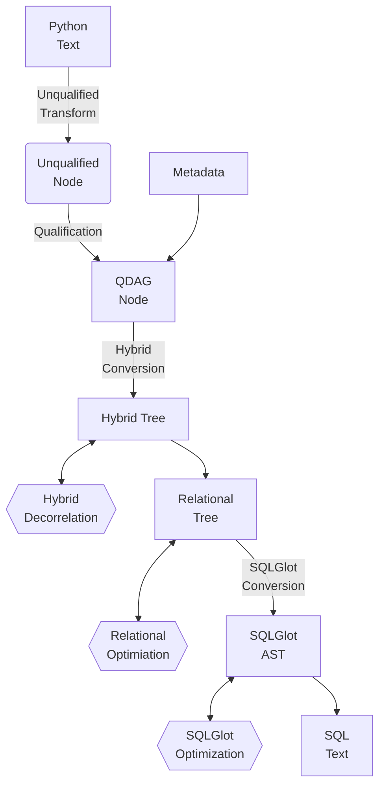
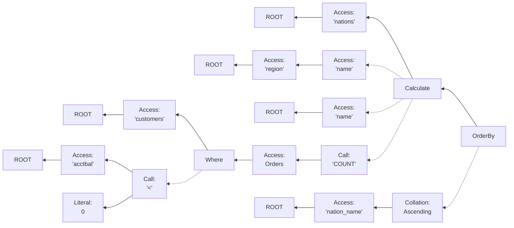
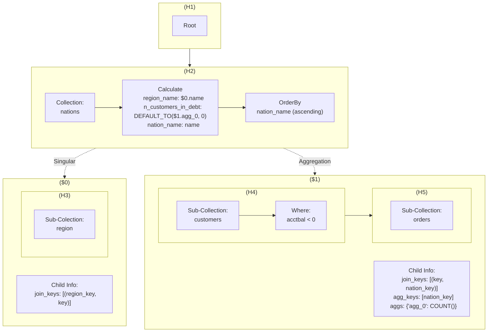
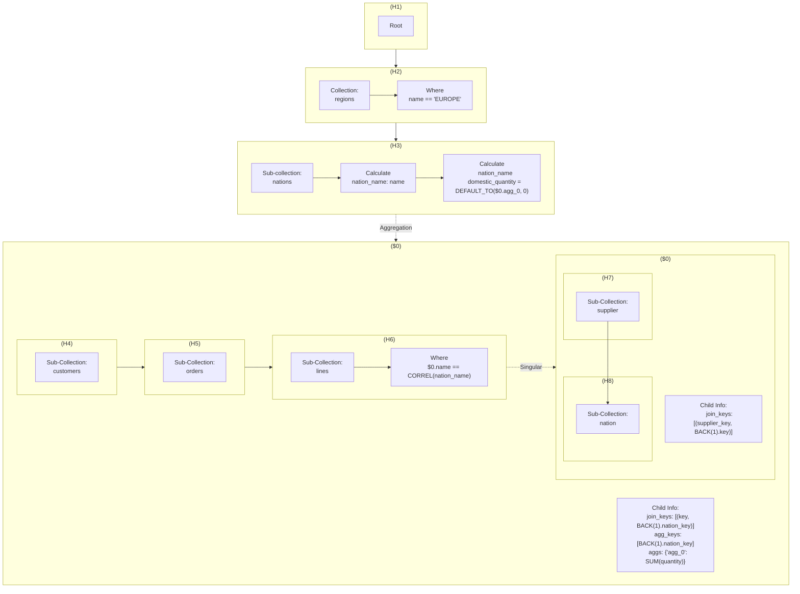
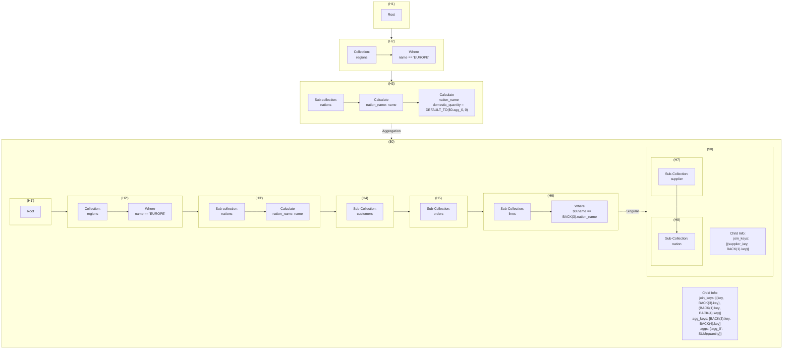
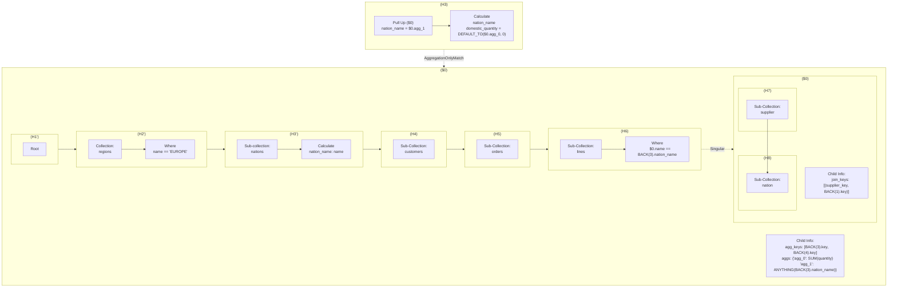
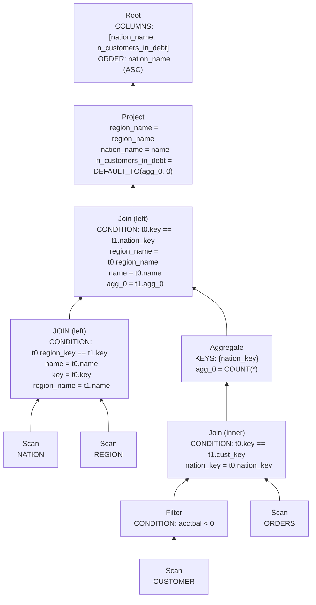

# PyDough Internal Representations Guide

This document describes the various IRs used by PyDough to convert raw PyDough code into SQL text, as well as the conversion processes between them.

<!-- TOC start (generated with https://github.com/derlin/bitdowntoc) -->

- [Overview](#overview)
- [Unqualified Nodes](#unqualified-nodes)
  - [Unqualified Transform](#unqualified-transform)
- [QDAG Nodes](#qdag-nodes)
  - [Qualification](#qualification)
- [Hybrid Tree](#hybrid-tree)
  - [Hybrid Conversion](#hybrid-conversion)
  - [Hybrid Decorrelation](#hybrid-decorrelation)
- [Relational Tree](#relational-tree)
  - [Relational Conversion](#relational-conversion)
  - [Relational Optimization](#relational-conversion)
- [SQLGlot AST](#sqlglot-ast)
  - [SQLGlot Conversion](#sqlglot-conversion)
  - [SQLGlot Optimization](#sqlglot-optimization)

<!-- TOC end -->

<!-- TOC --><a name="overview"></a>
## Overview

The overarching pipeline for converting PyDough Python text into SQL text is as follows:
1. The Python text is intercepted and re-written in a [transformation](#unqualified-transform) that replaces undefined variable names with certain objects, ensuring that when the Python code is executed the result is an [unqualified node](#unqualified-nodes). These unqualified nodes are very minimal in terms of information stored,
2. When `to_sql` or `to_df` is called on this unqualified nodes, it is first sent through a process called [qualification](#qualification) which converts unqualified nodes into qualified DAG nodes, or [QDAG nodes](#qdag) for short. These QDAG nodes utilize the metadata in order to correctly associate every aspect of the PyDough logic with the data being analyzed/transformed, and is also where a great deal of the verification of the PyDough code's validity happens.
3. Next, the QDAG nodes are run through a process called [hybrid conversion](#hybrid-conversion) which restructures the logic into the datastructure known as the [hybrid tree](#hybrid-tree) in order to better organize the types of ways different subtrees of the data are linked together.
4. The hybrid tree is further transformed by the [decorrelation procedure](#hybrid-decorrelation) to remove correlated references created by the hybrid conversion process.
5. The transformed hybrid tree is converted into a [relational tree](#relational-tree) highly reminiscent of the datastructure used to represent relational algebra in frameworks such as Apache Calcite. The conversion to this datastructure is called [relational conversion](#relational-conversion).
6. Several [optimizations](#relational-optimization) are performed on the relational tree to combine/delete/split/transpose relational nodes, resulting in plans that are better for performance and/or visual quality when converted to SQL.
7. The Relational tree is [converted](#sqlglot-conversion) into the [internal AST](#sqlglot-ast) used by the open source Python library SQLGlot. This library is used for transpiling between different SQL dialects, so it is trivial to convert the SQLglot AST into SQL text of many different dialects.
8. The SQLGlot AST is [simplified & optimized](#sqlglot-optimization) less so to improve the performance of the SQL when executed, and moreso to improve the visual quality when it is converted into text.
9. A simple method call on the final SQLGlot AST converts it into SQL text of the desired dialect, which can then be executed via a database connector API.

To recap, the overall pipeline is as follows (if viewing with VSCode preview, you must install the mermaid markdown extension):



<!-- TOC --><a name="unqualified-nodes"></a>
## Unqualified Nodes

The first intermediary representation of PyDough are the unqualified nodes, which carry minimal semantic information and instead carry the syntactic description of the PyDough query. Every unqualified node has a field `_parcel` which is a tuple of values, where the type signature of the tuple depends on which kind of unqualified node it is. Nodes that build on top of another node contain that other node object in their `_parcel`.

The reason this `_parcel` name is special (and RESERVED) is because whenever getattr is used on an UnqualifiedNode, except for very few names, the logic will instead return a new node referring to an access of a term from the previous node. E.g. if `foo` is an unqualified node and I write `foo.bar`, this returns `UnqualifiedAccess(foo, "bar")` which means "access term `bar` from `foo`".

The same idea of Python functionality building new nodes on top of existing nodes also goes for PyDough operations & Python magic methods. For example:
- `foo.CALCULATE(...)` returns an unqualified node for a calculate operation that points to `foo` in its parcel as the thing it is building on top of.
- `x == y` returns an unqualified node for a function call where the operator is `==` and the operands are `x` and `y`.

> [!NOTE]
> As a consequence of the `==` behavior, unqualified nodes should never be used as dictionary keys, cached via `@cache`, or compared with `==`, because this will always return a new unqualified node instead of a boolean indicating whether or not they are equal. Instead, it is better to convert the unqualified nodes to strings then check if the strings are equal. All unqualified nodes have a repr implementation that dumps their full structure (so `str` and `repr` should NOT be used as casting functions in PyDough).

Most magic methods have this sort of behavior, with some notable exceptions. For example, `__len__` is not allowed because any implementation of that magic method in Python must return an integer, so it cannot return a call to the `LENGTH` function in PyDough (unlike `__abs__`, which is implemented so when `abs` is called on an unqualified node it invokes the `ABS` PyDough function).


Below is an example of the structure of unqualified nodes for the following PyDough expression:
```py
nation_info = nations.CALCULATE(
  region_name=region.name,
  nation_name=name,
  n_orders_from_debt_customers=COUNT(customers.WHERE(acctbal < 0).orders)
).ORDER_BY(nation_name.ASC())
```



In the example above, the value of the `nation_info` is the `OrderBy` node on the right side of the diagram.

<!-- TOC --><a name="unqualified-transform"></a>
### Unqualified Transform

The unqualified nodes are created by executing Python code after a transformation is applied to modify the text. This modification creates a variable at the top of the code block called `_ROOT` which is an unqualified root, then replaces all undefined variables `x` with `_ROOT.x`. For example, the `nation_info` example earlier would be rewritten into the following, which then gets executed with `graph` passed in to the environment.

```
_ROOT = UnqualifiedRoot(graph)
nation_info = _ROOT.nations.CALCULATE(
  region_name=_ROOT.region.name,
  nation_name=_ROOT.name,
  n_orders_from_debt_customers=_ROOT.COUNT(_ROOT.customers.WHERE(_ROOT.acctbal < 0).orders)
).ORDER_BY(_ROOT.nation_name.ASC())
```

All of these `_ROOT.x` terms become `UnqualifiedAccess` nodes accessing term `x` and pointing to `_ROOT` as the thing they are accessing from, except for `_ROOT.COUNT`, which becomes a function call because the transformation recognizes this as a function name.

There are several variations of the logic that invoke this rewrite in different contexts, (e.g. unit tests vs jupyter notebooks) but they all occur in [unqualified_transform.py](../PyDough/unqualified/unqualified_transform.py).


<!-- TOC --><a name="qdag-nodes"></a>
## QDAG Nodes

TODO

For an example of the QDAG structure, consider the `nation_info` example earlier from the unqualified nodes:

```py
nation_info = nations.CALCULATE(
  region_name=region.name,
  nation_name=name,
  n_orders_from_debt_customers=COUNT(customers.WHERE(acctbal < 0).orders)
).ORDER_BY(nation_name.ASC())
```

This has the following structure as QDAG nodes:

```
──┬─ TPCH
  ├─── TableCollection[nations]
  ├─┬─ Calculate[region_name=$1.name, nation_name=name, n_customers_in_debt=COUNT($2)]
  │ ├─┬─ AccessChild
  │ │ └─── SubCollection[region]
  │ └─┬─ AccessChild
  │   ├─── SubCollection[customers]
  │   └─┬─ Where[acctbal < 0]
  │     └─── SubCollection[orders]
  └─── OrderBy[nation_name.ASC(na_pos='first')]
```

<!-- TOC --><a name="qualification"></a>
### Qualification

TODO

<!-- TOC --><a name="hybrid-tree"></a>
## Hybrid Tree

TODO

<!-- TOC --><a name="hybrid-conversion"></a>
### Hybrid Conversion

TODO

For an example of the Hybrid Tree structure, consider the `nation_info` example earlier from the unqualified nodes:

```py
nation_info = nations.CALCULATE(
  region_name=region.name,
  nation_name=name,
  n_customers_in_debt=COUNT(customers.WHERE(acctbal < 0).orders)
).ORDER_BY(nation_name.ASC())
```



In this example, the main hybrid tree has two levels H1 and `H2` (`H2` is the value pointed to when the QDAG is converted to a hybrid tree).
- `H1`/`H2` have a parent/successor relationship where H1 is the parent and `H2` is the successor.
- `H1` has no children and its pipeline has a single operation denoting the root level.
- `H2` has two children (`$0` and `$1`) and its pipeline has 3 operations:
  - An access to the nations collection (how the step-down from `H1` to `H2` begins)
  - A calculate that defines `region_name`, `nation_name`, and `n_customers_in_debt`
  - An order-by that sorts by `nation_name` in ascending order.
- `$0` is a singular access, meaning the data from `H2` and `$0` can be directly joined without needing to worry about changes in cardinality. They are joined on the condition that the `region_key` term from `H2` equals the `key` term from the bottom subtree of `$0` (which is `H3`).
  - The contents of `$0` is just a single tree level `H3` which does not have any children and has a pipeline containing only an access to the `regions` collection.
- `$1` is an aggregation access, meaning the data from `$1` must first be aggregated before it is joined with `H2`. The aggregation is done by grouping on the `nation_key` field of the bottom subtree of `$1` (which is `H5`) and computes the term `agg_0` as `COUNT()`. Then, the result is joined with `H2` on the condition that the `key` term from `H2` equals the `nation_key` field just used to aggregate.
  - The contents of `$1` is two tree levels `H4` and `H5`. `H4` does not have any children and has a pipeline containing an access to the `customers` collection followed by a filter on the condition that `acctbal < 0`. `H5` does not have any children and only contains a single operation accessing the `orders` sub-collection of the parent level.


<!-- TOC --><a name="hybrid-decorrelation"></a>
### Hybrid Decorrelation

To understand why de-correlation matters, first consider the slightly more complex PyDough code example below. This PyDough code finds, for each nation in Europe, the total purchase quantity made by customers in that nation from suppliers in the same nation. 5 nations with the largest number of orders made by customers in that nation in the building market segment where the total price of the order is at least double the average of the total prices of **all** orders.

```py
selected_nations = regions.WHERE(
  name == "EUROPE"
).nations.CALCULATE(nation_name=name)
domestic_lines = customers.orders.lines.WHERE(supplier.nation.name == nation_name)
nation_domestic_purchase_info = selected_nations.CALCULATE(
    nation_name,
    domestic_quantity=SUM(domestic_lines.quantity),
)
```

Below is the Hybrid Tree structure for this query:



Notice that `H6` contains a filter condition `$0.name == CORREL(nation_name)`. This means that even though `H6` is inside child `$0` of `H3` (not to be confused with child `$0` of `H6`), it still references the `nation_name` field from `H3`. This is a called a correlated reference, because it means that child `$0` of `H3` requires information from `H3` in order to be derived, but the whole point is that the data from child `$0` is calculated then joined onto he data from `H3`, so there is a catch-22.

To fix this, we next run the de-correlation procedure. This will recursively traverse the entire tree and look for hybrid nodes that have a correlated child (where the child type is NOT semi/anti join, since those two do allow correlated references). This procedure will reach tree `H3` and see that its child `$0` is correlated and is an `AGGREGATION` connection, and will therefore de-correlate it. It does so by copying the entire hybrid tree so far (`H1`, `H2`, and the first two operators from `H3`) and attaching them to the top of child `$0`, above `H4`. This now means that the `CORREL(nation_name)` term in `H6` can be rephrased into a back-reference to the `nation_name` field in the copied version of `H3` (which is 3 levels above `H6`). This does change the join/aggregation keys when connecting H3 to child `$0`, since now we must connect each unique record of `H3` to the corresponding prepended section of `$0`. This is done by changing the join keys into the uniqueness keys of `H1`/`H2`/`H3`, which is aka `key` from `regions` (`BACK(1).key` from the perspective of `H3` and `BACK(4).key` from the perspective of `H6`) and `key` from `nations` (`key` from the perspective of `H3` and `BACK(3).key` from the perspective of `H6`).

The result is the following:




However, we can go one step further if we make an observation about this hybrid tree. Notice how now, we are computing the logic of `H1`, `H2`, and most of `H3` twice. This must happen if we intend to keep *every* nation, including the ones without any entries of `$0`. However, if we don't intend to keep nations where there are no records of `$0` to join onto, we can modify the original PyDough code as follows:

```py
selected_nations = regions.WHERE(
  name == "EUROPE"
).nations.CALCULATE(nation_name=name)
domestic_lines = customers.orders.lines.WHERE(supplier.nation.name == nation_name)
nation_domestic_purchase_info = selected_nations
.WHERE(HAS(domestic_lines)).CALCULATE(
    nation_name,
    domestic_quantity=SUM(domestic_lines.quantity),
)
```

With this modification, the original hybrid tree changes so the access to child `$0` of `H3` is now an `AGGREGATION_ONLY_MATCH` access, meaning we do an inner join instead of a left join. The de-correlation procedure will notice this and, after transforming child `$0` into its de-correlated form, realize it can do an optimization to delete the original `H1`, `H2` and prefix of `H3` since all of the data required from them is accessible inside `$0`. This is done via the hybrid "pull up" node, which specifies that the data comes from the specified child, instead of having existing data that gets joined with data from the child. This will look as follows:




The way to interpret this is that the entirety of child `$0` of H3 is evaluated, from `H1'` to `H6`, then grouped on `BACK(3).key` and `BACK(4).key` to calculate `agg_0` and `agg_1` (renaming the latter to `nation_name`), and that result is passed along from the PullUp node to the calculate in `H3` which builds on it.

<!-- TOC --><a name="relational-tree"></a>
## Relational Tree

TODO

For an example of the relational tree, consider the `nation_info` example from earlier.
```py
nation_info = nations.CALCULATE(
  region_name=region.name,
  nation_name=name,
  n_orders_from_debt_customers=COUNT(customers.WHERE(acctbal < 0).orders)
).ORDER_BY(nation_name.ASC())
```

Using the hybrid tree from earlier, the following is how the relational tree created by relational conversion could look:



<!-- TOC --><a name="relational-conversion"></a>
### Relational Conversion

TODO

<!-- TOC --><a name="relational-optimization"></a>
### Relational Optimization

TODO

<!-- TOC --><a name="sqlglot-ast"></a>
## SQLGlot AST

TODO

<!-- TOC --><a name="sqlglot-conversion"></a>
### SQLGlot Conversion

TODO

<!-- TOC --><a name="sqlglot-optimization"></a>
### SQLGlot Optimization

TODO
